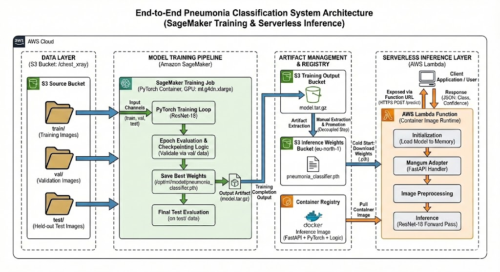
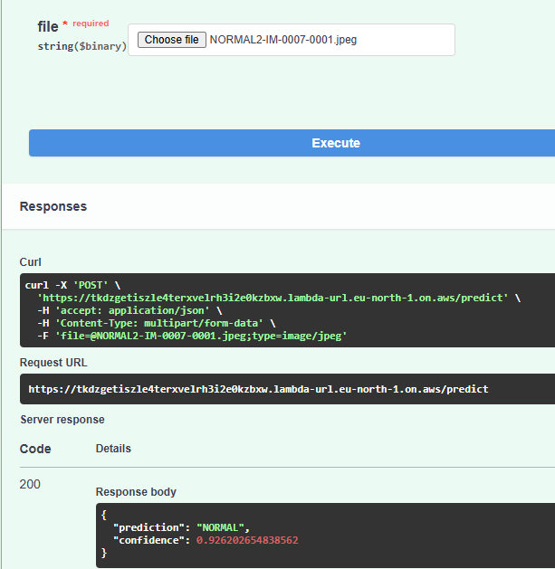
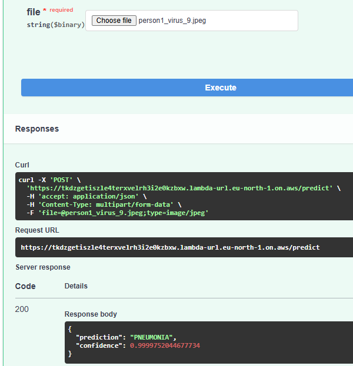

# End-to-End Pneumonia Classification System (SageMaker + Serverless Inference)
End-to-end deep learning system for pneumonia detection using PyTorch, Amazon SageMaker, and serverless inference on AWS.

> **⚠️ Disclaimer:** This project is not intended to provide medical advice.


## Overview

This project implements a production-style, end-to-end machine learning pipeline for medical image classification.

It covers:
- GPU-accelerated model training on Amazon SageMaker
- Serverless inference using AWS Lambda, FastAPI, and container images
- Artifact persistence and promotion via Amazon S3
- Best-checkpoint selection based on validation accuracy and loss
- Explicit train / validation / test dataset separation


---

## System Architecture

<p 
   align="center">
    <td align="center">
      <br>
      <em><strong>Fig 1:</strong> Architecture diagram generated with AI assistance (Gemini Banana Pro) based on my system design.</em>
    </td>
</p>

**High-level flow:**

S3 (dataset) → SageMaker (training) → S3 (model artifacts) → Lambda (serverless inference)

---

## Inference API (FastAPI)

**Endpoint:** `POST /predict`

- Accepts image uploads (`multipart/form-data`)
- Returns:
  - Predicted class: `PNEUMONIA` or `NORMAL`
  - Confidence score

FastAPI is adapted to AWS Lambda using Mangum.

The function is exposed via a Lambda Function URL, enabling direct HTTPS access without API Gateway.

### Swagger UI – Image Upload

<div align="center">
  
  
  <br><br>
  <em><strong>Fig 2:</strong> Side-by-side comparison of FastAPI <code>/predict</code> results for Normal vs. Pneumonia chest X-rays.</em>
</div>

---

## Data Layer (AWS S3)

All data is stored in Amazon S3 and passed into SageMaker as separate input channels.

**Dataset structure:**

- `s3://<bucket>/chest_xray/train/` — training images  
- `s3://<bucket>/chest_xray/val/` — validation images  
- `s3://<bucket>/chest_xray/test/` — held-out test images  

These are mounted inside the training container by SageMaker as:

- `/opt/ml/input/data/train`
- `/opt/ml/input/data/val`
- `/opt/ml/input/data/test`

---

## Model Training (AWS SageMaker)

Training is performed using a SageMaker PyTorch training job.

**Configuration:**
- Framework: PyTorch
- Model: ResNet-18 (ImageNet pretrained)
- Instance type: GPU-enabled (e.g. `ml.g4dn.xlarge`)
- Entry script: `train_model.py`

### Training Logic

- Images are resized and normalized to match ResNet-18 expectations
- I changed the output layer of Resnet to output 2 classes instead of 1000 classes.
- Training runs for a fixed number of epochs
- After each epoch:
  - Training loss is computed
  - Validation accuracy is computed
  - Validation loss is computed

### Best-Checkpoint Selection

The model is saved when:
- Validation accuracy is strictly higher than the current best, or
- Validation accuracy is equal and validation loss is lower

Best weights are saved to: `/opt/ml/model/pneumonia_classifier.pth`

### Final Evaluation

After training:
- The best weights are reloaded and input into our model
- The model is then ran on the test set
- Test accuracy and loss are logged

SageMaker automatically packages `/opt/ml/model/` into `model.tar.gz` and uploads it to S3.

---

## Artifact Management

The trained model artifact (`model.tar.gz`) produced by SageMaker is decoupled from inference infrastructure.

- The weights `pneumonia_classifier.pth` are manually extracted from `model.tar.gz` and uploaded to `s3://pneumonia-model-weights-eu-north-1/pneumonia_classifier.pth`
  
---

## Serverless Inference (AWS Lambda)

Inference is implemented using AWS Lambda running a container image.

### Inference Container

The Docker image includes:
- FastAPI application
- PyTorch (CPU-only)
- Torchvision and Pillow for image preprocessing
- Inference logic

The image is built locally and pushed to Amazon ECR.

AWS Lambda is configured to run directly from the ECR image.

### Cold Start Behaviour

On cold start:
1. Model weights are downloaded from Amazon S3.
2. The weights are written to /tmp (the writable portion of the AWS Lambda filesystem).
3. The model is loaded into memory from the /tmp file for inference.

On warm invocations:
- The loaded model is reused to minimize latency

---

## Design Highlights

- Clear separation of training and inference lifecycles
- GPU acceleration used only where necessary
- Explicit validation-driven checkpoint selection
- Serverless inference with automatic scaling
- Minimal cold-start overhead via model caching
- Infrastructure aligned with production ML patterns

---

## Quickstart

This project has two parts:

1) **Run inference locally (CPU)** using pre-trained weights (recommended to verify everything works)
2) **Full AWS pipeline** (S3 → SageMaker training → ECR → Lambda)

---

## 1) Run locally (CPU)

### Prereqs
- Python 3.10+
- (Recommended) macOS / Linux / WSL for easiest `/tmp` support

### Setup
```bash
git clone https://github.com/Daniel-Lawless/Pneumonia-Classifier-End-To-End.git
cd Pneumonia-Classifier-End-To-End

python -m venv venv
source venv/bin/activate   # Windows: venv\Scripts\activate

pip install -r requirements.txt
````

### Model weights 

Download the trained weights from GitHub Releases and place them where the app expects them:

macOS / Linux / WSL: 

```bash
mkdir -p /tmp
cp pneumonia_classifier.pth /tmp/model.pth
```

Windows (native Python):
```powershell
mkdir C:\tmp
copy .\pneumonia_classifier.pth C:\tmp\model.pth
```

### Run the API

```bash
uvicorn app:app --reload --port 8000
```

open swagger UI:
http://127.0.0.1:8000/docs

Or send a request with curl:
```bash
curl -X POST "http://127.0.0.1:8000/predict" \
  -H "accept: application/json" \
  -H "Content-Type: multipart/form-data" \
  -F "file=@path/to/xray.jpg;type=image/jpeg"
```

## 2) Full AWS pipeline (Training + Serverless Inference)

Please note; This section uses AWS resources and may incur cost.

### Prereqs:

- AWS account with permissions for: S3, SageMaker, ECR, Lambda, IAM
- AWS CLI configured
```bash
aws configure
```
- Docker installed (for building/pushing inference image)


### Data Preparation (Amazon S3)

Download the Chest X-Ray Images (Pneumonia) dataset:
[pneumonia_dataset](https://www.google.com/search?q=https://www.kaggle.com/paultimothymooney/chest-xray-pneumonia)

and organize it as follows:
- `s3://<your-bucket>/chest_xray/train/`
- `s3://<your-bucket>/chest_xray/val/`
- `s3://<your-bucket>/chest_xray/test/`

### Train on SageMaker
Edit `train_sagemaker.py` to use:
- your bucket paths
- your SageMaker execution role ARN

then run: 
```bash
python train_sagemaker.py
```

### Build & push inference image to ECR

```bash
# Login to ECR
aws ecr get-login-password --region <region> \
| docker login --username AWS --password-stdin <aws_account_id>.dkr.ecr.<region>.amazonaws.com

# Create repo (ignore error if it already exists)
aws ecr create-repository \
  --repository-name pneumonia-classifier-inference \
  --region <region>

# Build image
docker build -t pneumonia-classifier-inference .

# Tag image
docker tag pneumonia-classifier-inference:latest \
<aws_account_id>.dkr.ecr.<region>.amazonaws.com/pneumonia-classifier-inference:latest

# Push image
docker push <aws_account_id>.dkr.ecr.<region>.amazonaws.com/pneumonia-classifier-inference:latest
```

Next Steps:

- Create an AWS Lambda function using the ECR image

- Configure a Lambda Function URL or API Gateway

Upload a chest X-ray image to the /predict endpoint to receive:
- Predicted class (PNEUMONIA or NORMAL)
- Confidence score

---

## Improvements to be made:

- Automate model extraction from `model.tar.gz` via CI/CD
- Add monitoring and latency metrics
- Enable batch inference
- Versioned model artifacts
- Parameterize training configuration in `train_sagemaker.py` (remove hard-coded paths and resource values)
